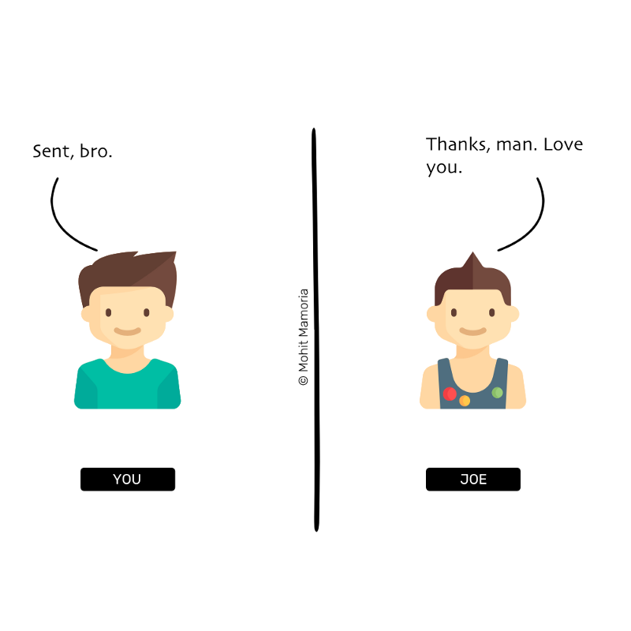

# WTF is The Blockchain?

Source: [《WTF is The Blockchain?》](https://hackernoon.com/wtf-is-the-blockchain-1da89ba19348)

Unless you’re hiding under the rock, I am sure you’d have heard of Bitcoins and Blockchain. After all, they are the trending and media’s favorite topics these days — the buzzwords of the year. Even the people who’ve never mined a cryptocurrency or understand how it works, are talking about it. I have more non-technical friends than technical ones. They have been bugging me for weeks to explain this new buzzword to them. I guess there are thousands out there who feel the same. And when that happens, there comes a time to write something to which everyone can point the other lost souls to — that’s the purpose of this post — written in plain english that any regular internet user understands.

除非你待在与世隔绝的地方，不然你不可能没听说过比特币和区块链这两个东西。毕竟最近这两个词已经是媒体的热门主题，是今年的时髦词。即使那些不关心或者一点也不了解这些东西怎么运行的人也在不停的讨论比特币和区块链。我的朋友大多数是非技术人员，但是他们已经好几周都要求我向他们解释一下这些新东西到底是怎么样的。我想应该还有很多像我朋友那样还不了解的人，所以是时候我出来写一篇文章，用通俗的语言解释一下比特币和区块链了。

> By the way, I am curator of a weekly newsletter, Unmade, which delivers one idea from the future to your inboxes.

> 顺便说一下，我是一份周报的管理者。Unmade，每周都会给你传递一个来自未来的想法。

## Blockchain: why do we even need something this complex?

## 区块链：为什么我们需要这么复杂的一个东西？

> “For every complex problem there is an answer that is clear, simple, and wrong.” — H. L. Mencken

> “对于每一个复杂问题，都有一个清楚、简单以及错误的答案。”——H.L.Mencken

Unlike every other post on the internet, instead of first defining the Blockchain, we’ll understand the problem it solves.

我们不会像网上其他文章一样，一上来就定义区块链是什么东西，相反，我们先来明白他到底解决了什么问题。

Imagine, Joe is your best friend. He is traveling overseas, and on the fifth day of his vacation, he calls you and says, “Dude, I need some money. I have run out of it.”

想象一下，Joe是你最好的朋友，他现在正在海外。在假期的第五天，他给你打电话，然后说：“Dude，我需要一点钱，我自己的钱已经用完了。”

You reply, “Sending some right away,” and hung up.

你于是回复。”马上给你汇款。”然后挂掉了电话。

You then call your account manager at your bank and tell him, “Please transfer $1000 from my account to Joe’s account.”

然后你给银行经理打电话告诉他：“帮我从我的账户里转1000美金到Joe的账户。”

Your account manager replies, “Yes, sir.”

你的银行经理回答。”好的，先生。“

He opens up the register, checks your account balance to see if you have enough balance to transfer $1000 to Joe. Because you’re a rich man, you have plenty; thus, he makes an entry in the register like the following:

他打开了登记薄，查看了你的账户，检查是否有足够的余额可以给Joe转账1000美金。因为你比较富有，账户余额充足，所以他在登记簿上登记了一下一条记录：

> Note: We’re not talking about computers only to keep things simple.

> 注意：我们没有讨论计算机，是因为我们想要把事情变得简单。

You call Joe and tell him, “I’ve transferred the money. Next time, you’d go to your bank, you can withdraw the $1000 that I have just transferred.”

你打电话给Joe，告诉他。“我已经转账了，接下来，你可以去银行，取回刚才我转的1000美金。“

What just happened? You and Joe both trusted the bank to manage your money. There was no real movement of physical bills to transfer the money. All that was needed was an entry in the register. Or more precisely, an entry in the register that neither you nor Joe controls or owns.

刚才发生了什么？你和Joe都相信银行，让银行来管理你的金钱。没有真实物理的金钱转移，所有的只是登记簿里面的一条记录，甚至这条记录也不是你和Joe可以控制或者拥有的。

And that is the problem of the current systems.

这就是现在系统的问题。

> To establish trust between ourselves, we depend on individual third-parties.

> 为了实现我们之间的信任，我们必须要依靠一个独立的第三方。

For years, we’ve depended on these middlemen to trust each other. You might ask, “what is the problem depending on them?”

这么多年，我们和其他人之间的信任都是通过第三方来完成的。你可能会问,“那这有什么问题吗？我的生活好像没有出现过问题。”

The problem is that they are singular in number. If a chaos has to be injected in the society, all it requires is one person/organization to go corrupt, intentionally or unintentionally.

这个问题在于，这些第三方是单一的。如果想要让这个过程变得混乱，只要一个个人或者一个组织故意或无意地做错事情。

- What if that register in which the transaction was logged gets burnt in a fire?
- What if, by mistake, your account manager had written $1500 instead of $1000?
- What if he did that on purpose?

- 如果交易记录的登记簿被火烧了怎么办？
- 如果你的银行经理把1000美金错误地写成了1500美金怎么办？
- 如果他是故意这么做的怎么办？

> For years, we have been putting all our eggs in one basket and that too in someone else’s.

> 这些年我们把所有的蛋都放在一个菜篮子里，其他人

Could there be a system where we can still transfer money without needing the bank?

那么有没有一种系统，让我们可以直接给其他人转账，但是不通过银行？

To answer this question, we’ll need to drill down further and ask ourselves a better question (after all, only better questions lead to better answers).

要回答这个问题，我们需要更加深入一点，问我们自己一个更加好的问题（毕竟一个更加好的问题才会引出一个更加好的答案）。

Think about it for a second, what does transferring money means? Just an entry in the register. The better question would then be —

思考一下，转账到底意味着什么？只是登记簿里面的一条记录。那么一个更好的问题就是——

> Is there a way to maintain the register among ourselves instead of someone else doing it for us?

> 那么是否可以我们这些人之间自己拥有一个登记簿，而不是第三方来帮组我们做这件事？

Now, that is a question worth exploring. And the answer is what you might have already guessed. The blockchain is the answer to the profound question.

现在，这是一个值得探讨的问题。这个问题的答案你可能已经猜到了。区块链就是这个答案。

It is a method to maintain that register among ourselves instead of depending on someone else to do it for us.

区块链就是一种方式，让我们能够自己管理这个登记簿，而不需要依赖第三方。

Are you still with me? Good. Because now, when several questions have started popping in your mind, we will learn how this distributed register works.

你还在看吗？很好，因为现在可能有几个问题在你的脑海里了，我们将通过这几个问题来了解这个分布式账本是如何工作的。

## Yes, but tell me, how does it work?

## 好的，那么请告诉我运行原理？

The requirement of this method is that there must be enough people who would like not to depend on a third-party. Only then this group can maintain the register on their own.

这种方式实现的必要条件是，有足够的不依赖与第三方，只有这样子这个群体才能够拥有一个属于自己的登记簿。

> “It might make sense just to get some Bitcoin in case it catches on. If enough people think the same way, that becomes a self-fulfilling prophecy.” — Satoshi Nakamoto in 2009
>

> “如果有足够多的人认为有必要持有一些比特币，以防未来比特币开始流行，那么这个系统就是可以实现的。”——中本聪，2009年

How many are enough? At least three. For our example, we will assume ten individuals want to give up on banks or any third-party. Upon mutual agreement, they have details of each other’s accounts all the time — without knowing the other’s identity.

多少人才是足够的？至少是三个人。在我们的例子中，我们将假设十个不同的人，他们都想要放弃银行或者第三方。在这个共识之上，他们能够随时可以在不知道其他人身份的情况下知道对方的账户信息，

### 1. An Empty Folder

### 1. 一个空的文件夹
Everyone contains an empty folder with themselves to start with. As we’ll progress, all these ten individuals will keep adding pages to their currently empty folders. And this collection of pages will form the register that tracks the transactions.

在一开始，参与者每个人都有一个属于他们的空的文件夹。随着整个过程的继续，十个参与者会持续地在他们的文件夹里增加页面。这些页面就像是登记簿，可以追踪所有的交易信息。

### 2. When A Transaction Happens

### 2. 当一条交易发生的时候

Next, everyone in the network sits with a blank page and a pen in their hands. Everyone is ready to write any transaction that occurs within the system.

每一个参与者都有一张空白的纸和一支笔，随时都准备着记录发生在这个系统中的任何交易信息。

Now, if #2 wants to send $10 to #9.

现在，如果#2 想要给#9号发送10美金。

To make the transaction, #2 shouts and tells everyone, “I want to transfer $10 to #9. So, everyone, please make a note of it on your pages.”

为了完成这个交易，#2呼叫并且告诉其他人，“我想要给#9发送10美金。所以每个人请在至少记录这条交易。”

Everyone checks whether #2 has enough balance to transfer $10 to #9. If she has enough balance, everyone then makes a note of the transaction on their blank pages.

于是每个人都都检查#2的账户里面是否与足够的余额来完成发给#9 10美金这笔交易。如果她有足够的余额，那么每个人都在他们纸上记录这笔交易。

The transaction is then considered to be complete.

这样，这笔交易就算是完成了。

### 3. Transactions Continue Happening

### 3. 更多的交易持续在发生

As the time passes, more people in the network feel the need to transfer money to others. Whenever they want to make a transaction, they announce it to everyone else. As soon as a person listens to the announcement, (s)he writes it on his/her page.

随着项目进行下去，网络中更多的人需要给其他人转送资金。任何时候当有一个人想要做一笔交易，都需要通过以上的方式告诉这个网络里面的其他人。其他人听到消息后，尽可能快的把交易信息记录到纸上。

This exercise continues until everyone runs out of space on the current page. Assuming a page has space to record ten transactions, as soon as the tenth transaction is made, everybody runs out of the space.

这个过程将会一直持续，直到每一个人都用光了当前纸张的页面。假设每一张纸都能够记录10条交易，当第十条交易记录下来，每个人都用好了这张纸的页面。

!

It’s time to put the page away in the folder and bring out a new page and repeat the process from the step 2 above.

这时候就把这张纸放到文件夹中，然后拿出一张新的纸，开始重复从第二步开始的操作过程。

### 4. Putting Away The Page

### 4. 放置纸张

Before we put away the page in our folders, we need to seal it with a unique key that everyone in the network agrees upon. By sealing it, we will make sure that no one can make any changes to it once its copies have been put away in everyone’s folder — not today, not tomorrow and not even after a year. Once in the folder, it will always stay in the folder — sealed. Moreover, if everyone trusts the seal, everyone trusts the contents of the page. And this sealing of the page is the crux of this method.

在把纸张放到文件夹的过程中，我们需要用一个其他人认同的、独一无二的密钥密封这张纸。通过这个过程，我们就能够确保在每个人的文件夹中的备份都是没有被修改过的，今天，明天，甚至一年之后都不能修改。进一步，如果每个人都信任密封结果，那么就相信这张纸上面记录的内容。所以如何密封就成为了整个系统的关键之处。

> [Jargon Box] It is called ‘mining’ on the page to secure it, but for the simplicity of it, we’ll keep calling it ‘sealing.’
>

> [Jargon Box]保护安全的方法叫做挖矿，但是为了简单起见，我们就把它叫做密封。

> Earlier the third-party/middleman gave us the trust that whatever they have written in the register will never be altered. In a distributed and decentralized system like ours, this seal will provide the trust instead.
>

> 之前的第三方或者中间人让我们相信，任何记录在登记簿里面的内容都是不能被修改的。在分布式、去中心化的系统，就像我们现在的这个，密封代替第三方，给我们提供了一种信任。

## Interesting! How do we seal the page then?

## 有趣！那么我们如何密封这页面呢？

Before we learn how we can seal the page, we’ll know how the seal works, in general. And as a pre-requisite to it is learning about something that I like to call…

在学习如何密封这纸张之前，我们先要知道密封一般是如何运行的？

### The Magic Machine

### 神奇的机器

Imagine a machine surrounded by thick walls. If you send a box with something inside it from the left, it will spit out a box containing something else.

想象一个被厚墙包围的机器，如果你从左边往机器内部放入一个装有某种物品的盒子，然后机器机会吐出一个装有另外东西的盒子。

> [Jargon Box] This machine is called ‘Hash Function,’ but we aren’t in a mood to be too technical. So, for today, these are ‘The Magic Machines.’
>

> [Jargon Box]这种机器叫做哈希函数，但是我们并不想提到太多技术，所以我们就把这机器叫做神奇的机器吧。

Suppose, you send the number 4 inside it from the left, we’d find that it spat out the following word on its right: ‘dcbea.’

假设，你从左边送入数字4，那么我们就能发现神奇机器从右边输出了'dcbea'。

How did it convert the number 4 to this word? No one knows. Moreover, it is an irreversible process. Given the word, ‘dcbea,’ it is impossible to tell what the machine was fed on the left. But every time you’d feed the number 4 to the machine, it will always spit out the same word, ‘dcbea.’

那么他是怎么把数字4转变成以上的字符串的？没有人知道。进一步，这是一个不可逆的过程。如果给定一个词，“dcbea"，几乎不可能猜出送入机器左边的那个字符串是什么。但是如果每一次你从左边给机器输入数字4，那么总会得到一样的字符串,"dcbea"。

Given the word, ‘dcbea,’ it is impossible to tell what the machine was fed on the left. But every time you’d feed the number 4 to the machine, it will always spit out the same word, ‘dcbea.’

给定字符串，“dcbea"，是不可能知道传给机器左边的内容是什么。但是如果以每次从左边给机器传递数字四，那么总会从右边得到相同的字符串”dcbea"。

Let’s try sending in a different number. How about 26?

让我们传递一个不一样的数字，比如26试试？

We got ‘94c8e’ this time. Interesting! So, the words can contain the numbers too.

这一次我们就会得到“94c8e"，非常有意思！所以输出来的字符串中也包含了数字。

What if I ask you the following question now:

那么如果我问你以下的问题，结果是怎么样的？

> “Can you tell me what should I send from the left side of the machine such that I get a word that starts with three leading zeroes from the right side of it? For example, 000ab or 00098 or 000fa or anything among the others.”

> ”你能否告诉我给机器左边传递什么样的数字，机器才能够输出一个开头有三个0的字符串？比如000ab 或者00098，亦或者其他这样的字符串。

Think about the question for a moment.

可以思考一下这个问题。

I’ve told you the machine has a property that we cannot calculate what we must send from the left after we’re given the expected output on the right. With such a machine given to us, how can we answer the question I asked?

我已经告诉你，这台机器有一个属性，就是不能从右边的输出来推测出左边的输入的内容。既然这样，那么我们应该怎么做呢？

I can think of one method. Why not try every number in the universe one by one until we get a word that starts with three leading zeroes?

我想到一个方法。为什么我们不一个数字一个数字试过去，直到我们得到以三个0开头的字符串？

Being optimistic, after several thousand attempts, we’ll end up with a number that will yield the required output on the right.

乐观一点的情况是，通过几千次的尝试，我们得到了我们想要的结果。

It was extremely difficult to calculate the input given the output. But at the same time, it will always be incredibly easy to verify if the predicted input yields the required output. Remember that the machine spits out the same word for a number every time.

给定输出结果，计算出对应的输入是一件非常困难的事情。但是同时，验证这个对应输入是否是正确却是难以置信地容易。记住，这台机器对于每一个输入都是有一个唯一的输出。

How difficult do you think the answer is if I give you a number, say 72533, and ask you the question, “Does this number, when fed into the machine, yields a word that starts with three leading zeroes?”

你认为给你一个数字，比如72533，然后问你问题，“这个数字作为输入，机器的右边能否产生一个以三个0作为开头的字符串结果？”

All you need to do is, throw the number in the machine and see what did you get on the right side of it. That’s it.

为了回答这个问题，只要把数字72533放到机器的左边，看机器右边产生的结果，然后比较一下就能够知道结果。

The most important property of such machines is that — “Given an output, it is extremely difficult to calculate the input, but given the input and the output, it is pretty easy to verify if the input leads to the output.”

这就是这台机器最重要的特性——“给定一个输出结果，找到这个结果的对应输入是非常困难的，但是相反，给定输入，那么非常容易判断这个输入是否是我们需要的结果。”

We’ll remember this one property of the Magic Machines (or Hash Functions) through the rest of the post:

我们将会通过下面的内容，具体了解这个神奇的机器（或者哈希函数）的这个特性。

> Given an output, it is extremely difficult to calculate the input, but given an input and output, it is pretty easy to verify if the input leads to the output.

> 给定一个输出结果，找到这个结果的对应输入是非常困难的，但是相反，给定输入，那么非常容易判断这个输入是否是我们需要的结果。

### How to use these machines to seal a page?

### 那么怎么使用这台机器来封装纸张？

We’ll use this magic machine to generate a seal for our page. Like always, we’ll start with an imaginary situation.

我们将会使用这台机器来封装记录了交易信息的纸张。同样，一开始我们要想象一个使用场景。

Imagine I give you two boxes. The first box contains the number 20893. I, then, ask you, “Can you figure out a number that when added to the number in the first box and fed to the machine will give us a word that starts with three leading zeroes?”

如果我给你了两个盒子，第一个盒子里面的数字是20893，然后问你，“你能够知道一个数字，这个数字和20893相加之后，从递给机器的左边，从右边得到一个以三个0作为开头的字符串吗？“

This is a similar situation as we saw previously and we have learned that the only way to calculate such a number is by trying every number available in the entire universe.

这和之前的情况类似，我们已经知道唯一的方法就是不断地尝试数字，直到得到想要的答案。

After several thousand attempts, we’ll stumble upon a number, say 21191, which when added to 20893 (i.e. 21191 + 20893 = 42084) and fed to the machine, will yield a word that satisfies our requirements.

经过几千次尝试，我们得到了一个数字，假设是21191，和20893想家之后，得到42084。结果放入机器之后，就会得到的字符串正好符合我们的要求。

In such a case, this number, 21191 becomes the seal for the number 20893. Assume there is a page that bears the number 20893 written on it. To seal that page (i.e. no one can change the contents of it), we will put a badge labeled ‘21191’ on top of it. As soon as the sealing number (i.e. 21191) is stuck on the page, the page is sealed.

> [Jargon Box] The sealing number is called ‘Proof Of Work,’ meaning that this number is the proof that efforts had been made to calculate it. We are good with calling it ‘sealing number’ for our purposes.
>

If anyone wants to verify whether the page was altered, all he would have to do is — add the contents of the page with the sealing number and feed to the magic machine. If the machine gives out a word with three leading zeroes, the contents were untouched. If the word that comes out doesn’t meet our requirements, we can throw away the page because its contents were compromised, and are of no use.

We’ll use a similar sealing mechanism to seal all our pages and eventually arrange them in our respective folders.

### Finally, sealing our page…

To seal our page that contains the transactions of the network, we’ll need to figure out a number that when appended to the list of transactions and fed to the machine, we get a word that starts with three leading zeroes on the right.

> Note: I have been using the phrase ‘word starting with three leading zeroes’ only as an example. It illustrates how Hashing Functions work. The real challenges are much more complicated than this.
>

Once that number is calculated after spending time and electricity on the machine, the page is sealed with that number. If ever, someone tries to change the contents of the page, the sealing number will allow anyone to verify the integrity of the page.

Now that we know about sealing the page, we will go back to the time when we had finished writing the tenth transaction on the page, and we ran out of space to write more.

As soon as everyone runs out of the page to write further transactions, they indulge in calculating the sealing number for the page so that it can be tucked away in the folder. Everyone in the network does the calculation. The first one in the network to figure out the sealing number announces it to everyone else.

Immediately on hearing the sealing number, everyone verifies if it yields the required output or not. If it does, everyone labels their pages with this number and put it away in their folders.

But what if for someone, say #7, the sealing number that was announced doesn’t yield the required output? Such cases are not unusual. The possible reasons for this could be:

- He might have misheard the transactions that were announced in the network
- He might have miswritten the transactions that were announced in the network
- He might have tried to cheat or be dishonest when writing transactions, either to favor himself or someone else in the network

No matter what the reason is, #7 has only one choice — to discard his page and copy it from someone else so that he too can put it in the folder. Unless he doesn’t put his page in the folder, he cannot continue writing further transactions, thus, forbidding him to be part of the network.

> Whatever sealing number the majority agrees upon, becomes the honest sealing number.
>

** Then why does everyone spend resources doing the calculation when they know that someone else will calculate and announce it to them? Why not sit idle and wait for the announcement? **

Great question. This is where the incentives come in the picture. Everyone who is the part of the Blockchain is eligible for rewards. The first one to calculate the sealing number gets rewarded with free money for his efforts (i.e. expended CPU power and electricity).

Simply imagine, if #5 calculates the sealing number of a page, he gets rewarded with some free money, say $1, that gets minted out of thin air. In other words, the account balance of #5 gets incremented with $1 without decreasing anyone else’s account balance.

That’s how Bitcoin got into existence. It was the first currency to be transacted on a Blockchain (i.e. distributed registers). And in return, to keep the efforts going on in the network, people were awarded Bitcoins.

When enough people possess Bitcoins, they grow in value, making other people wanting Bitcoins; making Bitcoins grow in value even further; making even more people wanting Bitcoins; making them grow in value even further; and so on.

> The rewards make everyone keep working in the network.
>

And once everyone tucks away the page in their folders, they bring out a new blank page and repeat the whole process all over again — doing it forever.

>[Jargon Box] Think of a single page as a Block of transactions and the folder as the Chain of pages (Blocks), therefore, turning it into a Blockchain.
>

And that, my friends, is how Blockchain works.

Except that there’s one tiny thing I didn’t tell you. Yet.

Imagine there are five pages in the folder already — all sealed with a sealing number. What if I go back to the second page and modify a transaction to favor myself? The sealing number will let anyone detect the inconsistency in the transactions, right? What if I go ahead and calculate a new sealing number too for the modified transactions and label the page with that instead?

To prevent this problem of someone going back and modifying a page (Block) as well as the sealing number, there’s a little twist to how a sealing number is calculated.

## Protecting modifications to the sealing numbers

Remember how I told you that I had given you two boxes — one containing the number 20893 and another empty for you to calculate? In reality, to calculate the sealing number in a Blockchain, instead of two boxes, there are three — two pre-filled and one to be calculated.

And when the contents of all those three boxes are added and fed to the machine, the answer that comes out from the right side must satisfy the required conditions.

We already know that one box contains the list of transactions and one box will contain the sealing number. The third box contains the output of the magic machine for the previous page.

With this neat little trick, we have made sure that every page depends on its previous page. Therefore, if someone has to modify a historical page, he would also have to change the contents and the sealing number of all the pages after that, to keep the chain consistent.

If one individual, out of the ten we imagined in the beginning, tries to cheat and modify the contents of the Blockchain (the folder containing the pages with the list of transactions), he would have to adjust several pages and also calculate the new sealing numbers for all those pages. We know how difficult it is to calculate the sealing numbers. Therefore, one dishonest guy in the network cannot beat the nine honest guys.

What will happen is, from the page the dishonest guy tries to cheat, he would be creating another chain in the network, but that chain would never be able to catch up with the honest chain — simply because one guy’s efforts and speed cannot beat cumulative efforts and speed of nine. Hence, guaranteeing that the longest chain in a network is the honest chain.

> Longest chain is the honest chain.
>

When I told you that one dishonest guy cannot beat nine honest guys, did it ring any bell in your head?

## What if, instead of one, six guys turn dishonest?

In that case, the protocol will fall flat on its face. And it is known as “51% Attack”. If the majority of the individuals in the network decides to turn dishonest and cheat the rest of the network, the protocol will fail its purpose.

And that’s the only vulnerable reason why Blockchains might collapse if they ever will. Know that, it is unlikely to happen but we must all know the vulnerable points of the system. It is built on the assumption that the majority of a crowd is always honest.

And that, my friends, is all there is about Blockchains. If you ever find someone feeling left behind and wondering, “WTF is the Blockchain?” you know where you can point them to. Bookmark the link.

Can think of someone right now who should read this? The ‘Share’ button is all yours.

